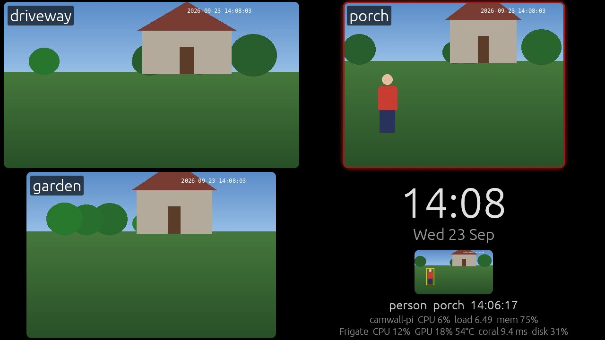
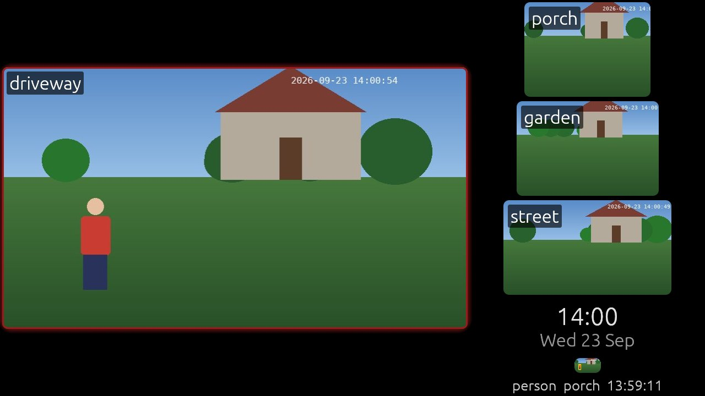

# camwall

A full screen camera wall for [Frigate](https://frigate.video). Put it on a Raspberry Pi with a screen and
leave it running.



Every camera is shown next to a clock and the latest tracked event, refreshed from Frigate's snapshot
API. Everything else comes from the same WebSocket the Frigate web UI uses, so camwall only needs the
Frigate URL and a login. No MQTT broker is involved.

- A camera with active tracked objects gets the same red outline as in the Frigate live view.
- When Frigate raises an alert, that camera takes over the screen and shows when the alert started,
  until the alert ends.
- The latest event is shown under the clock with its label, camera and time.
- Tiles are fetched at the size they are drawn, and the grid picks the column count that makes the
  cameras largest, so it works the same on a 7" 800x480 panel and on a 4K monitor.
- Tap a camera to show it full screen, tap again to go back.
- The screen can dim when nothing is happening, turn off after a longer time, and come straight back
  when something is detected.
- The display's own CPU, temperature, load and memory, and Frigate's CPU, GPU, detector speed and
  recording disk use, sit at the bottom of the clock panel. The display line turns red if a Raspberry
  Pi reports undervoltage.
- A tile turns red and says why when its feed goes stale, and a banner shows when Frigate cannot be
  reached.

Tested with Frigate 0.18 on a Raspberry Pi 4 running Raspberry Pi OS Lite (trixie).



## Frigate user

Create a user with the `viewer` role in Frigate (Settings, Users) for camwall to log in with. Frigate's
authenticated port is 8971 and uses a self signed certificate by default, so set `FRIGATE_INSECURE=1`
unless you have put a real certificate on it.

If you point camwall at the unauthenticated port 5000, leave `FRIGATE_USER` unset.

## Configuration

All settings are environment variables.

| Variable | Default | |
|---|---|---|
| `FRIGATE_URL` | required | e.g. `https://frigate.local:8971` |
| `FRIGATE_USER` | none | Frigate username; no login when unset |
| `FRIGATE_PASSWORD` | none | |
| `FRIGATE_INSECURE` | `0` | `1` skips TLS certificate checks |
| `CAMERAS` | from Frigate | Comma separated list, in display order |
| `LAYOUT` | `grid` | `grid`, or `feature` for one large camera with the rest in a column |
| `INTERVAL` | `0.5` | Seconds between snapshot fetches per camera |
| `BRIGHTNESS` | `1` | Normal brightness, `0` to `1` or a percentage |
| `DIM_AFTER` | off | Seconds without activity before dimming |
| `DIM_BRIGHTNESS` | `0.25` | Brightness while dimmed |
| `OFF_AFTER` | off | Seconds without activity before the screen turns off |
| `SCREEN_OFF_COMMAND` | none | Shell command run when the screen turns off |
| `SCREEN_ON_COMMAND` | none | Shell command run when it turns back on |
| `BACKLIGHT` | first found | Device in `/sys/class/backlight`, or `none` to dim in software |
| `DIAGNOSTICS` | `1` | `0` hides the display and Frigate stats |
| `CLOCK_FORMAT` | `%H:%M` | [chrono format](https://docs.rs/chrono/latest/chrono/format/strftime/index.html) |
| `DATE_FORMAT` | `%a %d %b` | |

Without `CAMERAS`, camwall shows the cameras that are enabled and visible on Frigate's dashboard,
sorted by their `ui.order`.

## Brightness and screen off

Activity means an active tracked object or an alert on any shown camera, or a touch. With
`DIM_AFTER=60`, the screen fades to `DIM_BRIGHTNESS` after a minute without activity and brightens again
as soon as there is some. With `OFF_AFTER=1800`, it goes black after half an hour and snapshot fetching
pauses until the next activity. A touch that wakes the screen does not also open a camera.

If the display has a backlight in `/sys/class/backlight`, as the official Raspberry Pi touch displays do,
camwall sets it directly, and at `OFF_AFTER` the backlight goes to zero. The camwall user needs write
access to it, which `dist/90-backlight.rules` grants to the `video` group. HDMI displays usually have no
such control, so camwall dims by drawing black over the picture. That makes the picture darker but leaves
the backlight on.

To turn an HDMI display off at `OFF_AFTER`, set the two commands. Under cage, `wlr-randr` can disable
the output:

```
SCREEN_OFF_COMMAND=wlr-randr --output HDMI-A-1 --off
SCREEN_ON_COMMAND=wlr-randr --output HDMI-A-1 --on
```

Run `wlr-randr` as the camwall user to find the output name. A TV can be put in standby over HDMI CEC
with `cec-ctl` instead.

## Build

```
cargo build --release
```

For a Raspberry Pi 4 or 5 from an x86 machine with `gcc-aarch64-linux-gnu` installed:

```
rustup target add aarch64-unknown-linux-gnu
cargo build --release --target aarch64-unknown-linux-gnu
```

The build host's aarch64 glibc must be no newer than the one on the Pi. A static musl build will not
work because EGL and Wayland are loaded at runtime. Prebuilt x86_64 and aarch64 binaries are attached
to each GitHub release.

## Running on a Raspberry Pi

camwall is a Wayland app. On a Pi without a desktop, run it under
[cage](https://github.com/cage-kiosk/cage), a compositor that shows one app full screen.

```
sudo apt install --no-install-recommends cage libegl1 libgles2 libgl1-mesa-dri wlr-randr
sudo useradd --system --shell /usr/sbin/nologin --groups video,render,input camwall
sudo install -m755 camwall /usr/local/bin/
sudo install -m640 -g camwall dist/camwall.env.example /etc/camwall.env
sudo install -m644 dist/camwall.service /etc/systemd/system/
sudo install -m644 dist/90-backlight.rules /etc/udev/rules.d/
sudo systemctl disable getty@tty1
sudo systemctl enable --now camwall
```

Edit `/etc/camwall.env` before starting it. The service takes over tty1 and restarts camwall if it
exits. To stop the console blanking the screen, add `consoleblank=0` to `/boot/firmware/cmdline.txt`.

To take a screenshot of the running wall, install `grim` and run:

```
sudo -u camwall env XDG_RUNTIME_DIR=/run/user/$(id -u camwall) WAYLAND_DISPLAY=wayland-0 grim wall.png
```

On a desktop, just run the binary with the variables set.

## License

MIT
